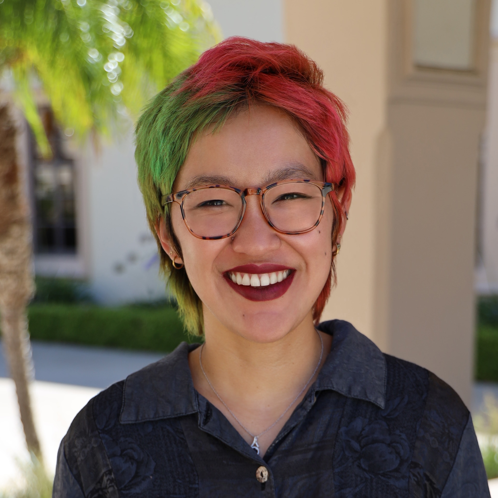
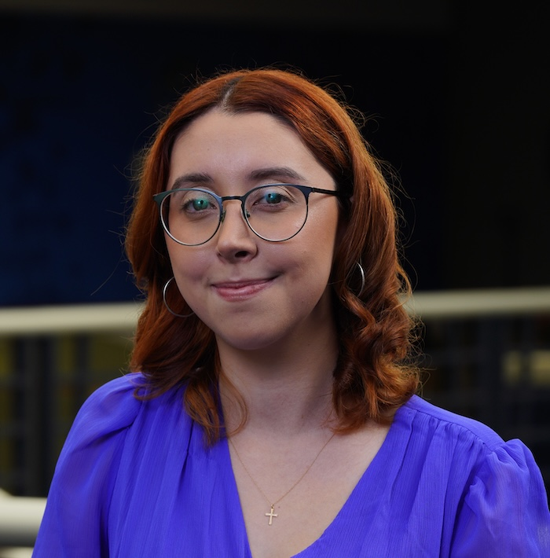
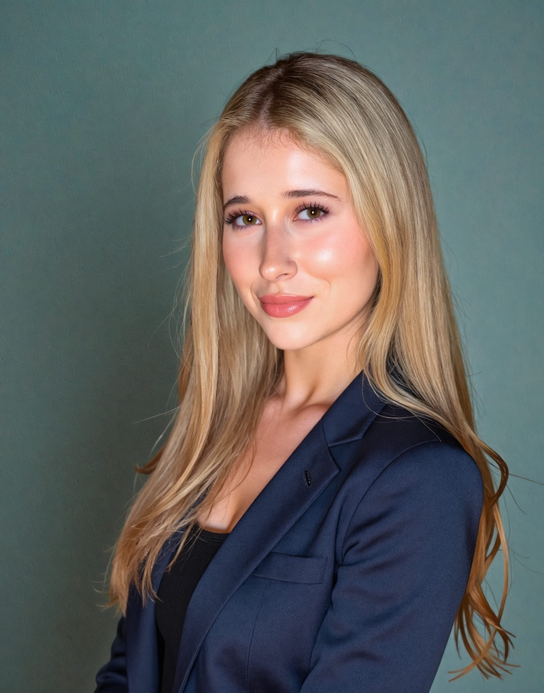
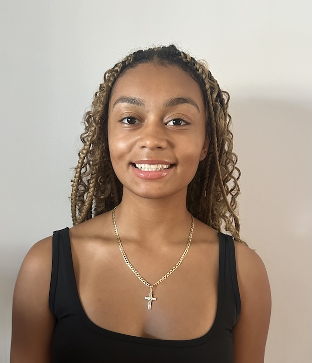
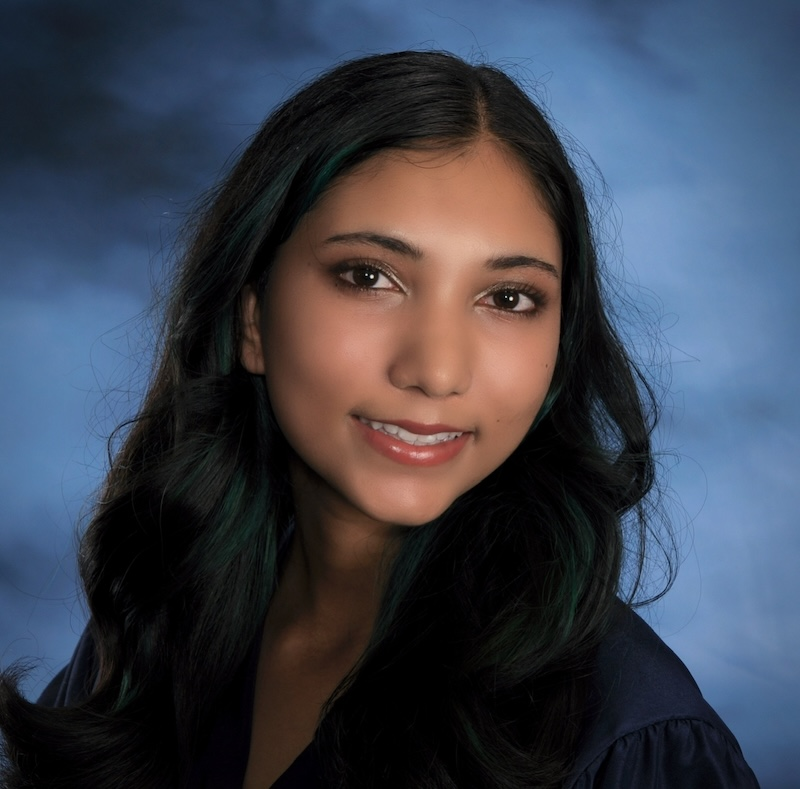
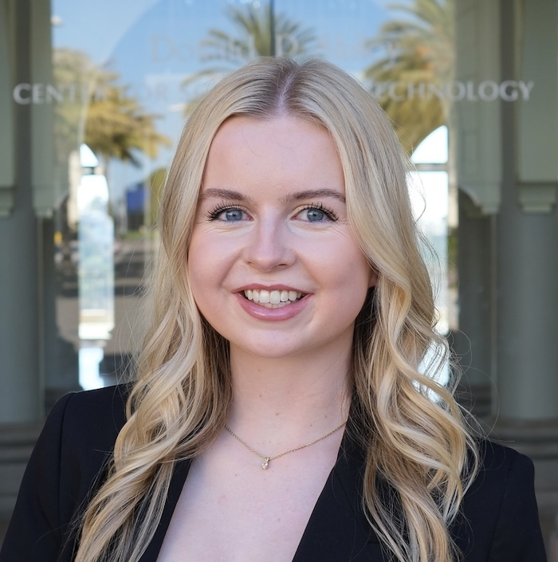
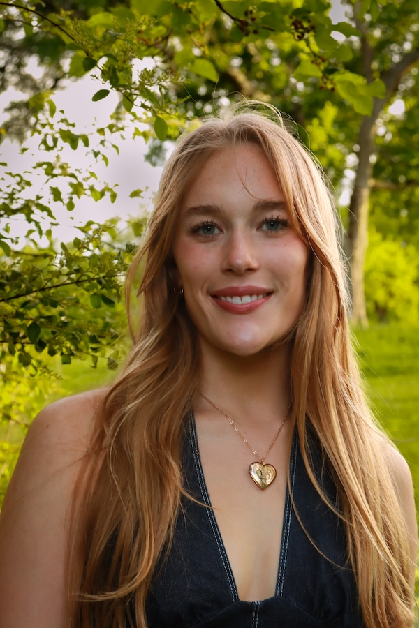
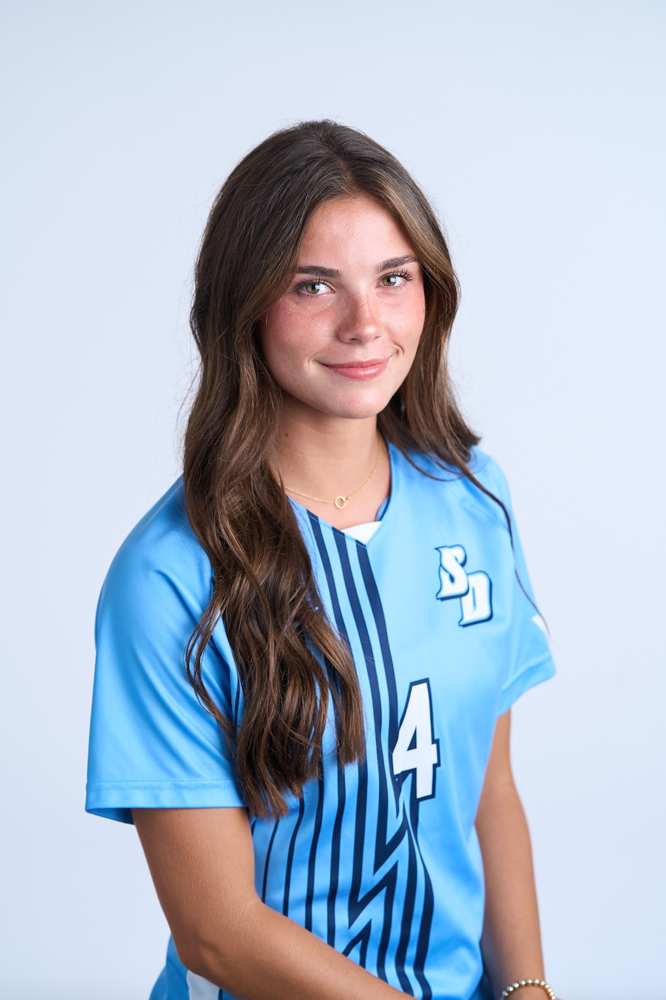

## Lab director

:::: {layout="[ 30, 70 ]"}

::: {#first-column-headshot}

:::

::: {#second-column-bio}

**Monica Thieu, PhD** is an Assistant Professor in the Department of Neuroscience, Cognition, & Behavior at the University of San Diego. She uses behavioral, computational modeling, and neuroimaging methods to quantify the contributions of perceptual information to emotional experience. She also contributes to community maintenance for open-source scientific computing software.

Monica earned her B.A. in psychology from Stanford University under Drs. Melina Uncapher and Anthony Wagner, where she also worked as a lab manager, and her Ph.D. in psychology from Columbia University under Dr. Kevin Ochsner. She then completed postdoctoral training as an NIH IRACDA FIRST fellow at Emory University, both in research under Dr. Philip Kragel, and in teaching at Spelman College under Dr. Jimmeka Wright.

[CV](https://www.monicathieu.com/cv.html)

:::

::::

## Post-baccalaureate research assistants

:::: {layout="[ 30, 70 ]"}

::: {#first-column-headshot}

:::

::: {#second-column-bio}

**Chiara Cossio** is a post-baccalaureate research assistant in the Department of Neuroscience, Cognition, and Behavior at the University of San Diego. She earned her B.S. in Biology with minors in Psychology and Chemistry from St. Mary’s University. Her academic and research interests center on memory, cognition, and the neural mechanisms underlying human behavior.

Her research experience includes computational neuroscience, genetics, cell and molecular biology, and food biochemistry. She is particularly interested in understanding how different memory systems interact and how experiences influence memory over time. Chiara plans to pursue graduate study in psychology or neuroscience and ultimately hopes to conduct research investigating the neural mechanisms underlying memory and cognition.

:::

::::

## Undergraduate research assistants

:::: {layout="[ 30, 70 ]"}

::: {#first-column-headshot}

:::

::: {#second-column-bio}

**Sophie Johnston,'29** is a Neuroscience student at the University of San Diego with a focused interest in the future of biopharmaceutical development. Her academic work centers on translating complex biological systems into practical therapeutic applications that improve patient outcomes. She is particularly drawn to the intersection of scientific research, regulatory strategy, and clinical development within large pharmaceutical organizations.

:::

::::

:::: {layout="[ 30, 70 ]"}

::: {#first-column-headshot}

:::

::: {#second-column-bio}

**Ashanthy Pardilla, '28** is an undergraduate student at the University of San Diego pursuing a Bachelor of Science degree in Cognition and Behavior with a minor in Biomedical Ethics. Her academic interests center on the relationship between cognition, emotion, and behavior, with a particular interest in understanding the cognitive and emotional processes that influence human behavior. Her research interests include cognitive and emotional responses, perception, and the ways in which individuals process and respond to experiences. She plans to pursue a career in healthcare and continue applying her background in cognition and behavior to better understand and support individuals’ cognitive and emotional well-being.

:::

::::

:::: {layout="[ 30, 70 ]"}

::: {#first-column-headshot}

:::

::: {#second-column-bio}

**Sonya Patel, '29** will graduate from the University of San Diego '29 with a B.A. in Psychology and minor in Cognitive Science. She is  interested in understanding the structures of the brain and how they relate to our internal beliefs and behaviors. She plans on pursuing her PhD in clinical psychology. Her current studies include childhood adolescence & development and neuroscience statistics.   

:::

::::

:::: {layout="[ 30, 70 ]"}

::: {#first-column-headshot}

:::

::: {#second-column-bio}

**Finley Sasena, '27** is an undergraduate student at the University of San Diego pursuing a degree in Neuroscience. Her research interests center on the relationship between brain function, behavior, and health, with a particular focus on cognition, emotion, stress, and individual differences in psychological and physiological responses. She is interested in exploring how a deeper understanding of these processes can contribute to improving health and patient care. Following graduation, Finley plans to pursue a career in medicine, where she hopes to integrate her scientific background with compassionate, patient-centered care.

:::

::::

If you are an interested USD student, please [contact Dr. Thieu](contact.qmd) to submit a statement of interest! I recruit research assistants on a rolling basis before each semester depending on project needs and fit.

## Former lab members

<!-- 
notes to self: comment out headshot paths and bios to keep as records until sufficient time has passed for deletion
current lab members in alphabetical order
former lab members in graduation year then alphabetical order
-->

**Ari Bradford, '26** <!--  is an undergraduate student at the University of San Diego, pursuing a Bachelor's degree in Neuroscience with a minor in Philosophy. Her acadmic interests focus on the intersection of neuroscience with the human experience. Her research interests include Alzheimer's disease, psychiatric disorders, and the neural mechanisms underlying emotion.  --> 

**Annelyse Basha, '26** <!-- S26 -->

**Valentina Alvarado, '28** <!-- is an undergraduate student at the University of San Diego majoring in Neuroscience. She is especially interested in how neuroscience can be applied to clinical practice, with a focus on understanding brain disorders, neural injury, and the biological basis of mental health disorders. Through research and clinical exposure, she plans to integrate scientific knowledge with patient care. Valentina plans to attend medical school and pursue a career in neurology or psychiatry, where she hopes to combine her passion for neuroscience with patient-centered medicine. -->

**Lucy Cook, '28** <!-- is an undergraduate student at the University of San Diego, pursuing a Bachelor’s of Science degree in Neuroscience with a minor in Chemistry. Her academic interests focus on the intersection of Neuroscience with Pharmacology. Her primary research interests lie in the study of medications and drugs and their specific effects on the brain. She plans to attend medical school and specialize in anesthesiology and applying her knowledge of neuro-pharmacology to clinical practice.  -->

**Clara Geuzaine, '28** <!-- is an undergraduate student at the University of San Diego pursuing a Bachelor of Science in Neuroscience, with minors in Chemistry, Biology, and French. Her academic interests focus on how neural injuries affect cognition and emotions, and how changes in brain function influence behavior. She plans to attend medical school and apply her knowledge of neuroscience to clinical practice. In addition to her studies, Clara is a member of the University of San Diego Women’s Soccer Team.  -->

**Abraham Funk, '29** <!-- S26 -->
